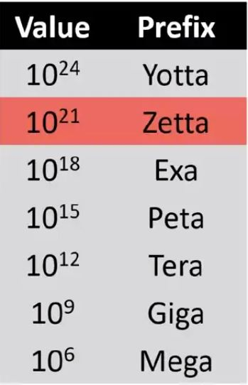

# R 

Antes que nada hay que hablar del paquete {Ari}, para generar voces automatizadas bajo un scrip y así crear contenido y editarlo más facilmente. Usa R Markdown y Amazon Polly para realizar contenido.

## Qué es ciencia de datos?
Tiene varios significados pero en general dicen lo mismo: Usar datos para responder preguntas. Es un campo muy amplio que incluye estadística, matemáticas, limpieza y formato de datos y visualización de datos. 
"Una revista de"The Economist" define un científico de datos como una persona capaz de combinar las habilidades de programa de software, estadistica, y arte para extraer los hilos de oro escondidos bajo montañas de datos.

hay un estimado de 1.2 Zettabytes de información actualmente disponible y este número está constantemente creciendo de manera exponencial. Por esta razon, saber utilizar toda esta cantidad de datos se vuelve unaobligación. En ese mismo orden de ideas también se necesitarán más científicos de datos con habilidades para intermpretar, analizar y manipular toda esta gran cantidad de información.

<center>
{width=15%}  

</center>  


Existen unas características que describen "big data".  
- Volumen: Grandes datasets con mucha información.  
- Velocidad: Es generado y colectado mucho más rápido de lo que se nunca se ha hecho.  
- Variabilidad: está en muchas formas y tipos y es variable (video, audio, video).    


## Las habilidades que debe tener un científico de datos son
Algunas de las características que se deben tener para ser un buen científico de datos, como se muestra la imagen son abilidades matemáticas, computacionales y en el campo donde se está trabajando, ya que ciencia de datos es una intercepción de estas.  
La **experticia** es importante para tener una buena pregunta y saber qué tipos de datos son los indicados para responder a esa pregunta en particular.
Para la organización de los datos, la descarga de los mismos y la manipulación de esta gran cantidad de información se necesita de habilidades computacionales, de código o **programación** , al menos en algún programa robusto como R, phytos y otros.    
Finalmente cuando se tienen los datos hay que analizarlos y por esto es que la **estadística** juega un papel importante en la ciencia de datos y en el proceso de respuesta de preguntas con datos.

<center>
{width=30%}

</center>


Hablando de la demanda, según linkedIn ciencia de datos está entre el Top 10 de los trabajos emerjentes (en 2017). Aparte de esto parece no haber suficientes cietíficos de datos conforma avanza su demanda en el mercado. Todo esto mientras existen cada vez más y más datos y estos siguen creciendo cada segundo en todos los campos, no sólo en finanzas. 

<center>
{width=60%}

</center>


## Qué son los datos?
Cambridge: Información, especialmente factores o numeros, colectados para ser examinados y analizados y usados para la toma de decisiones.  
Wikipedia: Set de valores de variables cualitativas o cuantitativas.  

Importante señalar que los datos son colectados, analizados y sobre todo usados para tomar decisiones. 


set de valores: En estadistica, la población de la 1ue estamos tratando de descubrir algo
Variables: Medidas o características de un item

Variables cuantitativas: medidas o información de cantidades o items numéricos
Variables cualitativas: medidas acerca de cualidades.

<center>
{width=75%}

</center>  
  
  
  
  
#### Algunos tipos de datos son
 - Secuencias (DNA, RNA)  
 - Datos de censos  
 - Datos médicos electrónicos  
 - SIG, Sistemas de información geográfica, mapas  
 - Imágenes  
 - palabras y traducciones  
 - trafico web  
 - datos personasles  
 
 
Un buen científico de datos primero tiene una pregunta y luego colecta los datos. **Los datos son importantes pero es secundario a tu pregunta.** 

## Ayuda
Una de las cosas más comunes con las que se topan los científicos de datos es con problemas que deben solucionar sin tener conocimiento de como hacerlo, para ello existen múltiples opciones para pedir ayuda. La abilidad para solucionar problemas está en la base de la ciencia de datos. Como la ciencia de datos es relativamente nueva, es muy común que seas la primer persona en enfrentarte con un problema que nadie haya enfrentado antes, por ellos es comun quedarse estancado y allí es donde pedir ayuda puede ser muy importante.

<center>
{width=60%}

</center>
  
  
  
  

Muchas veces la solución está simplemente en tus manos y se consigue leyendo manuales o las indicaciones de los programas o los paquetes que estés utilizando. Si posteas una pregunta trivial facilmente solucionada leyendo el manual en un foro, generalmente recibirás una respuesta como "lee el manual" o algo similar.
Un segundo paso es revisar en internet, pero antes debes estar seguro de que alguien no haya preguntado sobre lo mismo antes, para eso puedes hacer uso de los buscadosres en los foros. Una buena búsqueda en google o en internet siempre te dará un buen inicio y guía para solucionar tus preguntas.
Preguntarle a un par es siempre una estrategia que puede ser muy útil para solucionar tus preguntas y seguir adelante con tus análisis. Algún profesor o alguien con más experiencia que tu cabe en esta casilla.
Si ya haz intentado todo lo anterior y aún no haz conseguido solucionar tu problema, es hora de postear tu pregunta en un foro.
La imagen muestra qué se debe poner para hacer una pregunta adecuada en un foro. 

<center>
{width=75%} 

</center>
  
  
    
  
Algunos ejemplos de mensajes a la hora de escribir en foros para solucionar nuestros problemas se muestran a continuación, Nota que debes ser específico y mostrar la información completa, sin embargo no se debe poner información de más ni información que no sea importante en el proceso, al igual que se debe ser claro y revisar tu escritura. Finalmene debes estar seguro de que tu error **es replicable** de lo contrario, nadie podrá reproducirlo y por tanto no podrán ayudarte.


#### Malos:  
- HELP! Can't fit linear model!  
- HELP" Don't undestand PCA!  

#### Buenos:  
- R 3.4.3 lm() function produces seg fault with large data frame (windows 10)  
- Applied PCA to a matrix - what are U,D,and Vt?  

#### Excelentes:  
- R 3.4.3 lm() function on windows 10 - seg fault on large dataframe   
- Using principal components to discover common variation in rows of a matrix, should I use, U, D or Vt  

##  El proceso de ciencia de datos

El proceso para realizar un trabajo en ciencia de datos es complejo. Todos los proyectos comienzan con una pregunta que pueda ser respondida con datos. Es por esto que todo proceso comienza con una pregunta. El segundo paso es encontrar o generar los datos que vasa usar para responder a esa pregunta. Con la pregunta clara y los datos en las manos, se debe entonces proceder a analizar los datos explorando los datos y sacando conclusiones a travez de la matemática y la estadística. Finalmente queremos comunicar nuestros resultados con los demás, generalmente es un reporte que entregamos a los interesados, una presentación a un grpo de personas, un post en un blog o una publicación. 
Este último paso (comunicación) casi siempre está presente en la ciencia de datos y es un paso fundamental y debe ser formal.


<center>
{width=100%} 

</center>

Siempre es bueno y es parte importante del proceso presentar el código (code book) o los pasos que realizaste para obtener tus resultados, de esta forma todo puede ser replicado y verificado de forma científica. Además es importante para detectar posibles errores que puedas haber cometido en tu trabajo.

Algunos ejemplos de trabajos son:  

- https://sharlagelfand.netlify.app/posts/tidying-toronto-open-data/
- https://pennmusa.github.io/MUSA_801.io/project_5/index.html#5_feature_appendix
- http://varianceexplained.org/r/trump-tweets/
- https://masalmon.eu/2017/11/16/wheretoliveus/


##I Intalar R
R es un programa de lenguaje de programación que se centra esppecialmente en estadística y gráficos. Pero por qué usar R. Como se puede ver en la imagen es una de los lenguajes top 5 en popularidad para científicos de datos. R es muy flexible y puede extenderse no sólo a estadística o gráficos sino también a creación de pag web, realización de diapositivas, arte, creación de mapas, creación de aplicaciones y muchoas funcionalidades más. 


<center>
{width=70%} 

</center>


La razón por la cual R es tan popular es por la comunidad que crea cadad ia nuevos paquetes y mantienen pag y pag de foros y blog dedicados a solucionar problemas y a dibulgar soluciones referentes a el día a día del lenguaje.


para descargar r 
https://www.r-project.org/


para descargar RStudio
Integrated or interactive Development Environment (IDE)- entorno de desarrollo integrado
https://rstudio.com/products/rstudio/download/


para observar que versión de R estás corriendo usa
```{r}
version    #mira la versión
```

```{r}
sessionInfo()   # muestra la versión con la listas y paquetes que haz cargado
```


### Los paquetes de R 
Los paquetes en R son los que lo hacen tan especial, todos ellos se guardan en un lugar llamado 'library'. Un paquete es una colección de funciones, datos y código combinado de cierta manera para realizar algunas tareas. 14300 proxmadamente en 2015. Library es la librería y los paquetes son los libros.
Los paquetes se encuentran disponibles en los repositorios (web) donde allí están disponibles para su descarga.
Hay 3 repositorios principales
- CRAN (The Comprehensive R Archive Network). Principal
- GitHub (no es específico pero es muy popular)
- Bioconductor (Principalmente para bioinformatica y medicina)


#### Cómo puedo encontrar paquetes en R y cómo explorar su funcionalidad
1. CRAN por ejemplo agrupa los paquetes por algunas funcionalidades preestablecidas.

<center>
{width=70%} 

</center>

2. RDocumentation es una pag web para los paquetes de CRAN, BioConductor y GitGub donde puedes buscar información y explicación de los paquetes.


3. Google it


### Cómo puedo instalar un paquete
**Desde CRAN**
```
install.packages("nombre del paquete")
intal.packages(c("paquete1","paquete2","paquete3"))

```
**Desde Bioconductor**  
El repositorio 'Bioconductor' usa su propio método para instalar paquetes de allí.
```
source("https://bioconductor.org/biocLite.R") #Esto hace que la siguiente función que es la función principal de este repositorio quede disponible.
```
La función biocLite se usa para descargar el paquete 

```
biocLite()
biocLite("GenomicFeatures")   #para descargar 

```
**Desde GitHub**  
En GitHUb es un poco más específico. Debes tomar nota del autor y luego del nombre del paquete. Luego si no tienes intalado el paquete 'devtools' y luego usar la función 'install_github("autor/paquete') así:
```
install.packages("devtools")
library(devtools)
install_github("autor/paquete")

```

Instalar un paquete no hace inmediatamente disponible tener el paquete para usar, debes llamarlo. Siguiendo la analogía de que la library es la biblioteca y los paquetes son el libro, debes llamarlo o tomar el libro, esto se hace con la función 'library'

```
library(nombredelpaquete) #sin comillas
```


Algunos paquetes requieren de otros paquetes para ser cargados anteriormente. También algunos paquetes requieren unas versiones específicas de R, y debes verificarlo antes de instalarlo para que te funcione correctamente. Otras veces usas un paquete correctamente y cuando lo actualizas puede que tu scrip no corra correctamente de nuevo, por ello debes tener en cuenta la versión que estás usando y las actualizaciones de los paquetes.

 ```
installed.packages()  mostrará los paquetes que tienes instalados
library()   también hará lo mismo que intalled.packages()
old.packages()    mira cuales paquetes necesitan actualización
update.packages()    actualiza todos los paquetes que lo requieran
install. packages("nombredelpaquete")    para actualizar sólo un paquete
remove.packages("nombredelpaquete")   elimina un paquete
```


para ver que funciones tiene disponible un paquete utiliza la siguiente función

```{r}
help(package="ggplot2")
```

Muchos paquetes incluyen viñetas, que son documentos utiles que incluyen información y ejemplos de los paquetes y sus funciones.

```
browseVignettes("ggplot2")
```
_________________________________________________________________________________________


# Análisis de datos exploratorios
Exploratory Data Analysus (EDA)  

dir() #muestra los archivos que hay en tu directorio de trabajo o "working directory"
getwd()   
setwd()  
  
  
## Principios de gráficos analíticos
Cuando realizamos gráficos analíticos queremos contar unahistoria de lo que está pasando con nuestros datos. Algunas reglas pueden ser las siguieintes:
Principios.  

**1. Mostrar comparaciones:**  Esta es una idea básica en la ciencia en general ya que cada evidencia para una hipótesis o una idea del mundo siempre va a ser relativa a otra hipótesis. Entonces siempre debe haber una "comparado con qué". Un contexto. Generalmente puede ser un control. 


<center>
{width=50%} 

</center>

<center>
{width=50%} 

</center>


**2. Mostrar causalidad:**  Mecanismos, posibles explicaciones o estructuras sistemáticas, de cómo crees que el mundo funciona. Cuál es la cáusa para pensar en tu hipótesis.


<center>
![Una imagen que apoye nuestra explicación. En el ejmplo anterior vemos  que si instalas un limpiador de aire en un hogar los dpias sin síntomas de asma aumentan, pero por qué? Podemos decir que el limpiador de aire está limpiando el aire y removiendo material particulado del ambiente y así al ser removido no va a ir al pulmón de los niños y por tanto mostrará menos síntomas de asmas. Así mostramos un  gráfico que muestra la cantidad de material particulado y que puede ser una posible explicación de como funcionan los datos o por qué los datos muestran dicha tendencia](./Imagenes/causalidad.jpg){width=70%} 

</center>
Así podemos mostrar una pequeña explicación, pero para realmente confirmar la hipótesis de que el limpiador de aire funciona atravez de la limpieza del material particulado hay que realizar mucha más investigación y quizá experimentación, pero este es un gráfico que puede sugerir una posible explicación.

**3. Mostrar datos multivariados:** mostrar la mayor cantidad de datos que puedas en un solo plot. Y la razón es porque el mundo es indiscutiblemente multivariado, hay miles de cosas que suceden en un sólo sitio o lugar y 1, 2 ó pocas variables realmente nunca mostrarán lo que pasa en el mundo real. Si pones muchos más datos en un plot entonces vas a dar una historia mucho más creible.

<center>
{width=60%} 

</center>


Pero  en realidad puedes mirar otros escenarios ya que no sólo la calidad de el aire (materia particulada en este caso ) están asociados con la mosrtalidad. por ejemplo una de las cosas que podemos mirar cómo vambia la materia particulada en las diferentes estaciones en referencia a las muertes diaras en NY city.

<center>
{width=90%} 

</center>

Como vemos en el fráfico anterior, es el mismo gráfico que el gráfico sin separaciones de estaciones pero vemos que de manera muy interesante ahora parece que la relación es positiva cuando se separa por otra variable, esta vez estaciones del año.

Entonces parece ser paradógico, pero lo que sucede simplemente es que una vriable está enmascarando la relación entre otras dos. Así, dentro de cada estación del año la relación es ligeramente positiva **y cambia entre estaciones**.

**4. Integrar las evidencias que tenemos:** Siempre queres mostrar la mayor cantidad de evidencia que tengas, para que tu trabajo sea creible y convencer a todos de que lo que hiciste está bien hecho. Entonces no hay razón por la cual sólo tengas una presentación para tus resultados, como por ejemplo un plot o una tabla sólo tengas esa tabla o ese plot como resultado, puedes agregar palabras, números, imágenes, diagrámas, entre otros, no necesariamente. 
Una de las ventajas 

<center>
{width=70%} 

</center>

en la imagagen anterior vemos la relación entre la materia particulada y la admisión a las emergencias hospitalarias. Lo importante es ver la información extra por ejemplo la columna que dice probabilidad posterior al lado derecho  como dedida de la veracidad de la evidencia. Además hay un pedazo de texto (pie de imagen o leyenda) que muestra información importante acerca de los resultados y pone información importante que es dificil poner en un plot.


**5. Describir y documentar la evidencia:** Para esto puedes usar etiquetas apropiadas, o escalas o fuentes, entre otras, para dar credibilidad. Mostrar la fuente donde sacaste la información también es muy importante. y cómo sacaste la información o los datos es también muy importante.

**6. EL contenido es lo más importante:** Siempre tienes que neter en cuenta que historia quieres contar y que contenido tienes, que datos tienes, y luego que hayas pensado en esto, debes ver cual es la mejor forma de presetarlo y como se va a ver lo que uqieres presentar, porque si no tienes buen contenido entonces no hay mucho que puedas hacer.


